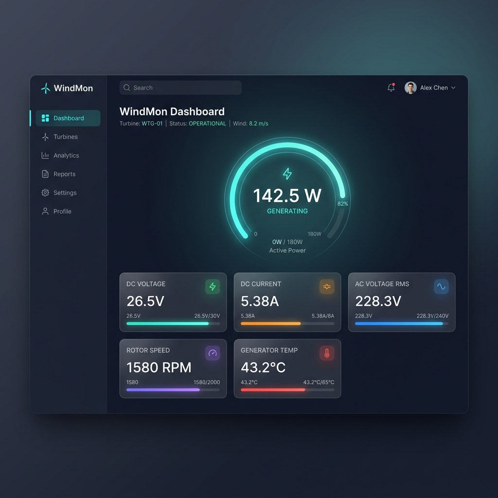
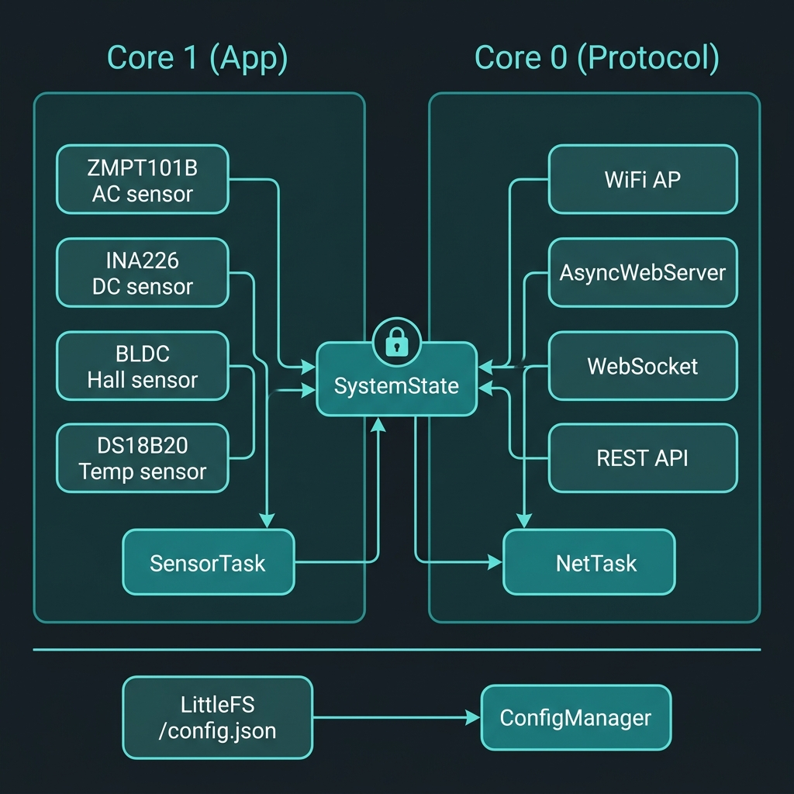
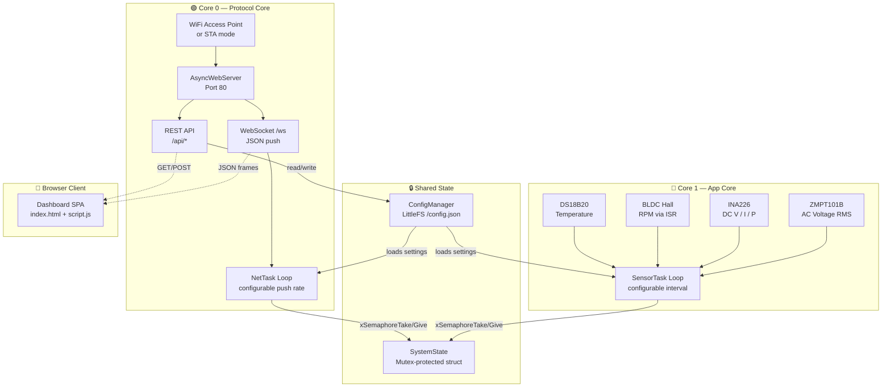
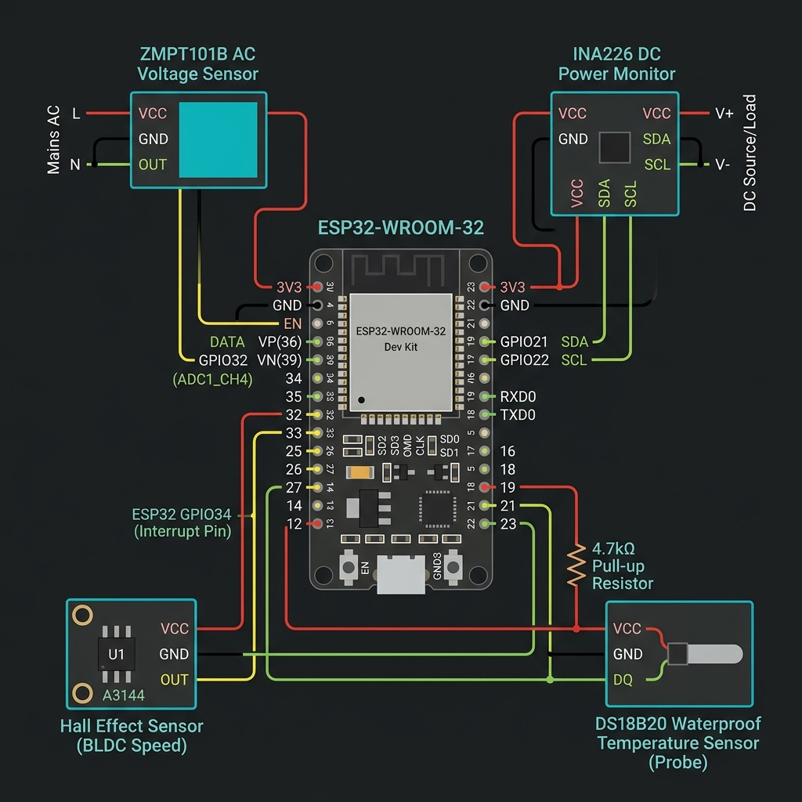
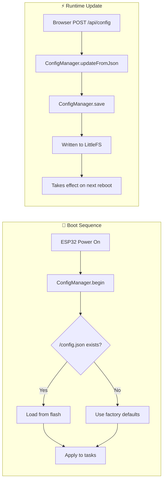
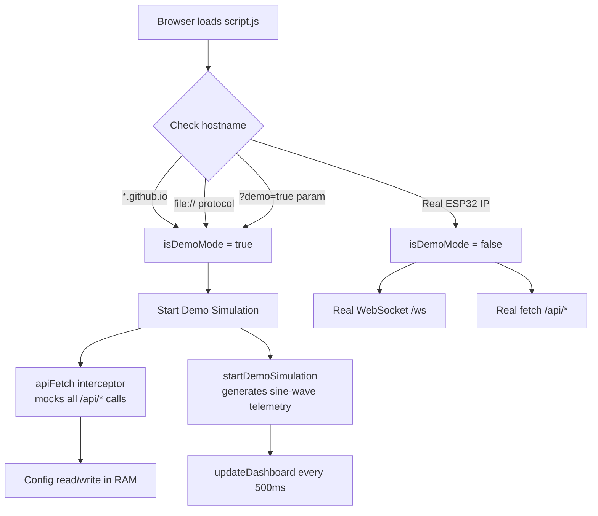

<p align="center">
  
</p>

<h1 align="center">🌬️ Portable Wind Turbine Monitoring System</h1>

<p align="center">
  <strong>Real-time ESP32-based generator monitoring with a premium glassmorphism web dashboard</strong>
</p>

<p align="center">
  
  
  
  
  
</p>

---

## 📋 Table of Contents

- [Overview](#-overview)
- [Dashboard Preview](#-dashboard-preview)
- [System Architecture](#-system-architecture)
- [Hardware & Wiring](#-hardware--wiring)
- [Sensor Modules](#-sensor-modules)
- [Web Dashboard Features](#-web-dashboard-features)
- [REST API Reference](#-rest-api-reference)
- [Configuration System](#-configuration-system)
- [Demo Mode (RNDG) — GitHub Pages](#-demo-mode-rndg--github-pages)
- [Project Structure](#-project-structure)
- [Getting Started](#-getting-started)
- [Wokwi Online Simulator](#-wokwi-online-simulator)
- [Memory Footprint](#-memory-footprint)
- [Troubleshooting](#-troubleshooting)

---

## 🔭 Overview

This firmware transforms an ESP32-WROOM-32 development board into a portable, self-contained wind turbine monitoring station. It samples generator outputs (AC/DC voltage, current, power, rotor speed, and temperature) at configurable rates and streams the data to any connected browser via WebSocket over a local WiFi Access Point.

**No internet, cloud, or external services required.** Connect your phone or laptop to the ESP32's WiFi AP, open the browser, and you have a live dashboard.

### Key Highlights

| Feature | Description |
|---|---|
| **Dual-Core FreeRTOS** | Sensor sampling on Core 1, networking on Core 0 — never blocks |
| **4 Sensor Drivers** | ZMPT101B (AC), INA226 (DC), Hall effect (RPM), DS18B20 (Temp) |
| **WebSocket Streaming** | Real-time push at configurable intervals (default: 500ms / 2Hz) |
| **Persistent Settings** | WiFi, timing, motor poles, display limits — saved to LittleFS flash |
| **Zero CDN Dependencies** | All SVG icons and CSS embedded — works 100% offline |
| **Static Demo Mode** | Auto-detects GitHub Pages hosting and generates fake live data |
| **Wokwi Simulator Ready** | All-in-one `.ino` file for online simulation without hardware |

---

## 🖥️ Dashboard Preview

The web interface is a single-page application (SPA) with two pages accessible via the sidebar:

### Dashboard Page
- **Power Ring Gauge** — Animated SVG circle showing real-time DC power output (W)
- **5 Metric Cards** — DC Voltage, DC Current, AC Voltage RMS, Rotor Speed, Generator Temperature
- **Dynamic Progress Bars** — Each metric has a color-coded bar scaled to configurable maximums
- **Live Connection Indicator** — Pulsing green dot when WebSocket is connected
- **Uptime Counter** — Formatted as `Xd Xh Xm Xs`

### Settings Page
- **WiFi / AP Configuration** — Change SSID and password with secure toggle
- **Sensor Timing** — Adjust poll interval (50–5000ms) and WebSocket push rate (100–10000ms)
- **Motor Configuration** — Set BLDC pole count for accurate RPM calculation
- **Display Limits** — Configure max voltage, current, RPM, and temperature for bar scaling
- **System Information** — Firmware version, free heap, uptime, connected client count
- **Device Controls** — Save configuration to flash, restart device remotely

---

## 🏗️ System Architecture

<p align="center">
  
</p>

The system uses the ESP32's dual-core Xtensa LX6 processor with FreeRTOS to run sensor sampling and networking in parallel:



### Thread Safety Model

The `SystemState` singleton wraps all sensor readings in a `SensorData` struct protected by a FreeRTOS mutex (`SemaphoreHandle_t`):

```
SensorTask (Core 1)                     NetTask (Core 0)
    │                                        │
    ├─ xSemaphoreTake(mutex)                 ├─ xSemaphoreTake(mutex)
    ├─ write acVoltage, dcVoltage, ...       ├─ read SensorData copy
    ├─ xSemaphoreGive(mutex)                 ├─ xSemaphoreGive(mutex)
    │                                        ├─ serialize to JSON
    ▼                                        ├─ ws.textAll(buffer)
   sleep(pollMs)                             ▼
                                            sleep(pushMs)
```

Both tasks never access the shared struct simultaneously — the mutex guarantees atomic reads and writes even across different CPU cores.

---

## 🔌 Hardware & Wiring

<p align="center">
  
</p>

### Pin Mapping Table

| Sensor | ESP32 Pin | GPIO | Bus / Protocol | Notes |
|---|---|---|---|---|
| **ZMPT101B** (AC Voltage) | ADC1_CH4 | `GPIO 32` | Analog (ADC1) | Must use ADC1 — ADC2 conflicts with WiFi |
| **INA226** (DC Power) | I2C SDA | `GPIO 21` | I2C (addr `0x40`) | Shared I2C bus |
| **INA226** (DC Power) | I2C SCL | `GPIO 22` | I2C (addr `0x40`) | Shared I2C bus |
| **BLDC Hall** (RPM) | Interrupt | `GPIO 34` | Digital (ISR) | Input-only pin, needs external pull-up |
| **DS18B20** (Temperature) | 1-Wire | `GPIO 4` | Dallas 1-Wire | Requires 4.7kΩ pull-up resistor to 3.3V |

### Power Requirements
- **ESP32 Dev Board:** 5V via USB or VIN pin (onboard 3.3V regulator)
- **ZMPT101B:** 5V power supply
- **INA226:** 3.3V–5V (I2C level compatible)
- **DS18B20:** 3.3V (parasitic power mode not recommended)

---

## 🔬 Sensor Modules

### ZMPT101B — AC Voltage (RMS)

The ZMPT101B is a voltage transformer-based sensor. The driver samples the analog waveform at high speed and computes the true RMS value using a software algorithm:

```
RMS = √( (1/N) × Σ(sample² - offset²) )
```

- **ADC Resolution:** 12-bit (0–4095)
- **Sampling Window:** Multiple AC cycles for accuracy
- **ADC Channel:** ADC1 only (ADC2 is reserved by WiFi driver)

### INA226 — DC Voltage, Current & Power

A high-side current/power monitor communicating over I2C:

- **Bus Voltage Range:** 0–36V
- **Current Sense:** Via external shunt resistor
- **Power:** Computed internally by the INA226 IC
- **I2C Address:** `0x40` (configurable via A0/A1 pins)

### BLDC Hall Sensor — Rotor Speed

A digital Hall-effect sensor generates pulses as the rotor magnets pass. An ISR (Interrupt Service Routine) counts pulses and calculates RPM:

```
RPM = (pulse_count × 60) / (elapsed_seconds × poles)
```

- **Pole Count:** Configurable via Settings page (default: 4)
- **Interrupt Type:** `RISING` edge on GPIO34

### DS18B20 — Generator Temperature

A waterproof 1-Wire digital thermometer:

- **Range:** -55°C to +125°C
- **Accuracy:** ±0.5°C (from -10°C to +85°C)
- **Resolution:** 12-bit (0.0625°C per step)
- **Read Mode:** Asynchronous (non-blocking request/read cycle)

---

## 🌐 Web Dashboard Features

### Design System
- **Theme:** Dark glassmorphism with `backdrop-filter: blur()` effects
- **Colors:** Teal primary (`#2dd4bf`), gradient accents, subtle card borders
- **Typography:** System font stack for fast loading without CDN
- **Layout:** Responsive CSS Grid — adapts from desktop (sidebar) to mobile (hamburger menu)
- **Icons:** Inline SVG — zero external dependencies
- **Animations:** CSS transitions on bars, ring gauge stroke animation, toast slide-in

### Responsive Breakpoints

| Screen Width | Layout |
|---|---|
| `> 768px` | Fixed sidebar + content area |
| `≤ 768px` | Hidden sidebar, hamburger menu, stacked grid |
| `≤ 480px` | Single-column metric cards |

### WebSocket Protocol

The dashboard connects to `ws://<device-ip>/ws` and receives JSON frames:

```json
{
  "acVolt": 228.3,
  "dcVolt": 26.52,
  "dcCur": 5.38,
  "dcPwr": 142.68,
  "rpm": 1580,
  "temp": 43.2,
  "uptime": 3661
}
```

The connection auto-reconnects every 2 seconds on disconnect.

---

## 📡 REST API Reference

All endpoints are served on port 80 by `AsyncWebServer`.

### `GET /api/config`

Returns the current device configuration:

```json
{
  "ssid": "WindTurbine_AP",
  "pass": "12345678",
  "pollMs": 100,
  "wsPushMs": 500,
  "poles": 4,
  "maxV": 60,
  "maxA": 20,
  "maxRPM": 3000,
  "maxTemp": 100
}
```

### `POST /api/config`

Saves new configuration to LittleFS flash. Send a JSON body with any subset of fields:

```json
{
  "ssid": "MyTurbine",
  "pollMs": 200,
  "poles": 6
}
```

**Response:**
```json
{ "ok": true }
```

### `GET /api/sysinfo`

Returns system health information:

```json
{
  "fw": "v1.0.0",
  "heap": 245100,
  "uptime": 3661,
  "clients": 2
}
```

### `POST /api/restart`

Triggers a device reboot (1-second delay before `ESP.restart()`):

```json
{ "ok": true }
```

---

## ⚙️ Configuration System

Settings are managed by `ConfigManager` and persisted as `/config.json` on LittleFS flash.



### Factory Default Values

| Parameter | Default | Range | Description |
|---|---|---|---|
| `ssid` | `WindTurbine_AP` | 1–32 chars | WiFi Access Point name |
| `pass` | `12345678` | 8–63 chars | WiFi password |
| `pollMs` | `100` | 50–5000 ms | Sensor sampling interval |
| `wsPushMs` | `500` | 100–10000 ms | WebSocket push interval |
| `poles` | `4` | 2–50 | BLDC motor magnetic poles |
| `maxV` | `60` | 1–500 V | Voltage bar maximum |
| `maxA` | `20` | 0.1–100 A | Current bar maximum |
| `maxRPM` | `3000` | 100–50000 | RPM bar maximum |
| `maxTemp` | `100` | 30–200 °C | Temperature bar maximum |

---

## 🎭 Demo Mode (RNDG) — GitHub Pages

The dashboard includes a **client-side simulation engine** that activates automatically when the page is hosted statically (e.g., on GitHub Pages). This allows anyone to preview the full UI without ESP32 hardware.

### How It Works



### What Gets Simulated

| Feature | Behavior in Demo Mode |
|---|---|
| **WebSocket telemetry** | Replaced by `setInterval` generating sine-wave sensor data |
| **GET /api/config** | Returns mock config from browser memory |
| **POST /api/config** | Saves to browser memory (survives until page refresh) |
| **GET /api/sysinfo** | Returns `v1.0.0-demo`, simulated heap/uptime |
| **POST /api/restart** | Shows success toast, reloads page after 5s |
| **Connection dot** | Shows green with "Live (Demo)" label |

### Activating Demo Mode

| Method | How |
|---|---|
| **GitHub Pages** | Deploy `data/` folder contents — auto-detected by hostname |
| **Local file** | Open `data/index.html` directly in browser — `file://` protocol detected |
| **URL parameter** | Append `?demo=true` to any URL |

### Zero Firmware Impact

The demo logic exists **only in `script.js`** (client-side JavaScript). It adds zero bytes to the compiled ESP32 binary. When served from the real device, `isDemoMode` evaluates to `false` and all requests go to the real ESP32 backend.

---

## 📂 Project Structure

```
MonitoringESP32-cl/
│
├── 📁 data/                          # LittleFS web assets (uploaded to flash)
│   ├── index.html                    # Dashboard SPA — sidebar, pages, cards
│   ├── style.css                     # Glassmorphism dark theme, responsive grid
│   └── script.js                     # WebSocket client, API calls, demo fallback
│
├── 📁 src/                           # Firmware source code
│   ├── config.h                      # Pin definitions & factory defaults
│   ├── main.cpp                      # Entry point — inits ConfigManager, starts tasks
│   │
│   ├── 📁 core/                      # Shared infrastructure
│   │   ├── SystemState.h / .cpp      # Mutex-protected SensorData struct
│   │   └── ConfigManager.h / .cpp    # JSON config load/save to LittleFS
│   │
│   ├── 📁 sensors/                   # Hardware abstraction drivers
│   │   ├── ZMPT101B.h / .cpp         # AC voltage RMS via ADC1
│   │   ├── INA226Sensor.h / .cpp     # DC voltage/current/power via I2C
│   │   ├── BLDCHall.h / .cpp         # RPM via hardware interrupt
│   │   └── DS18B20Sensor.h / .cpp    # Temperature via 1-Wire
│   │
│   ├── 📁 net/                       # Networking layer
│   │   └── WebServer.h / .cpp        # AsyncWebServer, WebSocket, REST API
│   │
│   └── 📁 tasks/                     # FreeRTOS task definitions
│       ├── SensorTask.h / .cpp       # Pinned to Core 1 — sensor loop
│       └── NetTask.h / .cpp          # Pinned to Core 0 — server + WS push
│
├── 📁 wokwi/                         # Online simulator (all-in-one)
│   ├── wokwi.ino                     # Merged sketch with PROGMEM web files
│   ├── diagram.json                  # Virtual wiring layout
│   └── readme.md                     # Wokwi setup instructions
│
├── 📁 docs/images/                   # README supporting images
│   ├── dashboard_preview.png
│   ├── architecture_diagram.png
│   └── wiring_diagram.png
│
└── platformio.ini                    # Build config & library dependencies
```

---

## 🚀 Getting Started

### Prerequisites

- **Hardware:** ESP32-WROOM-32 development board
- **Software:** [PlatformIO](https://platformio.org/) (VS Code extension or CLI)
- **Sensors:** ZMPT101B, INA226, Hall effect sensor, DS18B20

### Step 1: Clone the Repository

```bash
git clone https://github.com/SepTGut/MonitoringESP32-cl.git
cd MonitoringESP32-cl
```

### Step 2: Build the Firmware

```bash
pio run
```

Expected output:
```
RAM:   [=         ]  11.4% (used 37324 bytes from 327680 bytes)
Flash: [=====     ]  48.8% (used 639225 bytes from 1310720 bytes)
========================= [SUCCESS] =========================
```

### Step 3: Upload Firmware to ESP32

```bash
pio run -t upload
```

### Step 4: Upload Web Dashboard to Flash

This uploads `data/index.html`, `data/style.css`, and `data/script.js` to the ESP32's LittleFS partition:

```bash
pio run -t uploadfs
```

### Step 5: Connect and Use

1. **Power on** the ESP32
2. **Connect** your phone/laptop to the WiFi network:
   - **SSID:** `WindTurbine_AP`
   - **Password:** `12345678`
3. **Open** a browser and navigate to: `http://192.168.4.1`
4. **Monitor** live sensor data on the Dashboard tab
5. **Configure** settings on the Settings tab

---

## ⚡ Wokwi Online Simulator

The `wokwi/` folder contains a self-contained, single-file version of the entire project designed for [Wokwi](https://wokwi.com) online simulation.

### Key Differences from Main Firmware

| Aspect | Main Firmware (`src/`) | Wokwi Version (`wokwi/`) |
|---|---|---|
| **Web files** | Served from LittleFS flash | Embedded as `const char[] PROGMEM` |
| **Config storage** | LittleFS `/config.json` | ESP32 `Preferences` (NVS) |
| **WiFi mode** | Access Point (AP) | STA → `Wokwi-GUEST` network |
| **Sensor data** | Real hardware readings | Sine-wave mock generator |
| **File structure** | Multi-file modular | Single `wokwi.ino` |

### How to Use

1. Go to [wokwi.com](https://wokwi.com) and create a new **ESP32** project
2. Replace the default sketch with the contents of `wokwi/wokwi.ino`
3. Replace `diagram.json` with `wokwi/diagram.json`
4. Click **▶ Start Simulation**
5. Click the gateway link in the serial output to open the dashboard

See [`wokwi/readme.md`](wokwi/readme.md) for detailed instructions.

---

## 📊 Memory Footprint

Measured with PlatformIO `esp32dev` board profile:

| Resource | Used | Available | Usage |
|---|---|---|---|
| **RAM** | 37,324 bytes | 327,680 bytes | 11.4% |
| **Flash** | 639,225 bytes | 1,310,720 bytes | 48.8% |

The firmware leaves significant headroom for additional features like SD card logging, MQTT telemetry, or OTA updates.

---

## 🔧 Troubleshooting

### Dashboard shows "Offline"
- Verify the ESP32 is powered and the WiFi AP is visible
- Check that your device is connected to the correct SSID
- Open `http://192.168.4.1` (not HTTPS)
- Check Serial Monitor for boot messages

### Sensor reads zero
- Verify wiring matches the pin mapping table above
- Check I2C address for INA226 (default `0x40`)
- Ensure DS18B20 has a 4.7kΩ pull-up resistor
- Confirm ZMPT101B is on ADC1 pin (not ADC2)

### Configuration not saving
- The LittleFS partition must be formatted — run `pio run -t uploadfs` at least once
- Check Serial Monitor for "Failed to save" messages
- Verify sufficient flash space

### Demo mode activating on real device
- Demo mode only activates when the hostname ends with `.github.io`, the protocol is `file://`, or `?demo=true` is in the URL
- On the real ESP32, the hostname is an IP address (`192.168.4.1`) — demo mode will not trigger

---

## 📦 Dependencies

All managed automatically by PlatformIO:

| Library | Version | Purpose |
|---|---|---|
| [ArduinoJson](https://github.com/bblanchon/ArduinoJson) | ^6.21.3 | JSON serialization for API and config |
| [ESPAsyncWebServer](https://github.com/mathieucarbou/ESPAsyncWebServer) | ^3.1.5 | Async HTTP server and WebSocket |
| [OneWire](https://github.com/PaulStoffregen/OneWire) | ^2.3.7 | 1-Wire protocol for DS18B20 |
| [DallasTemperature](https://github.com/milesburton/Arduino-Temperature-Control-Library) | ^3.11.0 | DS18B20 temperature library |
| [INA226](https://github.com/RobTillaart/INA226) | ^0.6.0 | DC voltage/current/power monitor |

---

<p align="center">
  <sub>Built with ❤️ for renewable energy monitoring</sub>
</p>
