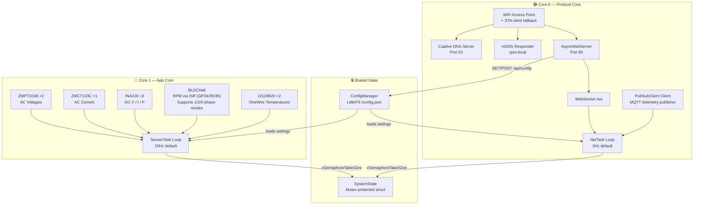

<p align="center">
  
</p>

<h1 align="center">🌬️ Monitor SaPa — Portable Wind Turbine Monitoring System</h1>

<p align="center">
  <strong>Real-time ESP32-based generator monitoring with a premium glassmorphism web dashboard, MQTT telemetry, dual network modes, and multi-sensor phase diagnostics.</strong>
</p>

<p align="center">
  
  
  
  
  
</p>

---

## 📋 Table of Contents

- [Overview](#-overview)
- [Dashboard Preview](#-dashboard-preview)
- [System Architecture](#-system-architecture)
- [Hardware & Wiring](#-hardware--wiring)
- [Sensor Modules & Pin Guards](#-sensor-modules--pin-guards)
- [Web Dashboard Features](#-web-dashboard-features)
- [REST API Reference](#-rest-api-reference)
- [Configuration System](#-configuration-system)
- [Demo Mode — GitHub Pages](#-demo-mode--github-pages)
- [Project Structure](#-project-structure)
- [Getting Started](#-getting-started)
- [Memory Footprint](#-memory-footprint)
- [Troubleshooting](#-troubleshooting)

---

## 🔭 Overview

This firmware transforms an ESP32-WROOM-32 development board into a portable, self-contained wind turbine diagnostic station named **Monitor SaPa**. It features an expanded multi-sensor architecture to sample AC/DC phases, power flow, temperatures, and rotor speeds, transmitting live metrics over a local WiFi Access Point or client network.

**No internet, cloud, or external services required.** Connect directly to the ESP32's WiFi AP to access a captive portal, or resolve `http://spm.local/` using mDNS. Stably publish telemetry feeds to an MQTT Broker.

### Key Highlights

| Feature | Description |
|---|---|
| **Dual-Core FreeRTOS** | Sensor sampling on Core 1, networking (WiFi, WebSocket, DNS, MQTT) on Core 0 |
| **Expanded Sensors** | ZMPT101B ×2 (AC Volts), ZMCT103C ×1 (AC Current), INA226 ×2 (DC Power), DS18B20 ×2 (Temp) |
| **Unused Pin Guards** | Assign `-1` (255) to any sensor pin to disable its initialization and bypass readings |
| **MQTT Telemetry** | Auto-reconnection loop publishing JSON metrics to external brokers |
| **mDNS & Captive Portal** | Local DNS responder and Async WebServer redirects unknown hosts to gateway |
| **Persistent Settings** | Save WiFi credentials, MQTT broker info, poles, and bounds to LittleFS |
| **Aesthetics & Motion** | outfit typography, glassmorphism theme, background animations, spinning turbine SVG |
| **Static Demo Mode** | Auto-detects GitHub Pages or local files to run local telemetry simulation |

---

## 🖥️ Dashboard Preview

The web interface is a single-page application (SPA) styled with custom variables, smooth transitions, and glassmorphism elements:

### Dashboard Page
- **Spinning Turbine SVG** — Aerodynamic wind turbine icon with rotation speed linked to RPM
- **Hero Power Ring** — Translucent circular gauge tracking primary DC wattage output
- **10 Grid Metric Cards** — 
  - **Generator DC Channel 1** (Voltage / Current)
  - **Load DC Channel 2** (Voltage / Current)
  - **AC Grid Channels** (Voltage 1 / Voltage 2 / Current)
  - **Physical Diagnostics** (Rotor Speed / Generator Temperature / Ambient Temperature)
- **Fluid Backdrops** — Smooth background glowing orbs drifting across the screen

### Settings Page
- **WiFi / AP Configuration** — Change gateway SSID/Password
- **WiFi Client Mode (STA)** — Enable home router connections to fetch local NTP/cloud access
- **MQTT Telemetry Card** — Configure broker IP, port, credentials, topics, and intervals
- **Sensor TIMING & Type** — Poll schedules, WebSocket speed, BLDC poles, and **RPM Sensor Type** selector (3-Phase internal Hall / 2-Phase internal Hall / 1-Phase external Hall / IR module)
- **System Information** — Free heap, firmware version, and connected client counters

---

## 🏗️ System Architecture

Networking and sensor polling are split across both CPU cores using a thread-safe mutex model:



---

## 🔌 Hardware & Wiring

All analog sensors must be wired to **ADC1 pins** because ADC2 is disabled when WiFi is transmitting. 

### Pin Mapping Table

| Component | ESP32 Pin | GPIO | Protocol | Notes |
|---|---|---|---|---|
| **ZMPT101B #1** | ADC1_CH4 | `GPIO 32` | Analog Input | Generator AC Voltage (1 of 3 Phase) |
| **ZMPT101B #2** | ADC1_CH5 | `GPIO 33` | Analog Input | Inverter AC Voltage Output |
| **ZMCT103C** | ADC1_CH0 | `GPIO 36` | Analog Input | Inverter AC Current Output |
| **INA226 #1** | I2C SDA / SCL | `GPIO 21 / 22` | I2C (addr `0x40`) | DC Charge Side (Before Battery) |
| **INA226 #2** | I2C SDA / SCL | `GPIO 21 / 22` | I2C (addr `0x41`) | DC Discharge Side (After Battery) |
| **Primary Hall / IR** | Interrupt | `GPIO 34` | Digital Input | Ext Hall / IR / Phase A |
| **BLDC Hall B** | Interrupt | `GPIO 35` | Digital Input | 2-Phase & 3-Phase Internal Hall B |
| **BLDC Hall C** | Interrupt | `GPIO 39` | Digital Input | 3-Phase Internal Hall C only |
| **DS18B20 ×2** | 1-Wire | `GPIO 4` | Dallas 1-Wire | Shared bus: Battery (index 0), Ambient (index 1) |

---

## 🔬 Sensor Modules & Pin Guards

### -1 (255) Pin Guards
If a sensor is not wired, its pin macro can be defined as `-1` (which casts to `255` as a `uint8_t` configuration variable):
- Bypasses pin initialization (`pinMode`) and reading commands.
- Bypasses interrupt binding (`attachInterrupt`) to prevent ESP32 core panic exceptions.
- Returns a safe default value (`0.0f` / `0`) to the dashboard interface.
- If `INA226` I2C pins or address are set to `255` or `0`, the I2C begin routine is ignored to prevent hanging the Wire bus.

### ZMPT101B / ZMCT103C AC Sampling
Samples the high-speed AC waveform over a window of 25ms (at least one full 50Hz/60Hz cycle) and computes RMS:
$$\text{RMS} = \sqrt{\frac{1}{N}\sum_{i=1}^{N}(V_i - V_{\text{offset}})^2}$$

---

## 🌐 Web Dashboard Features

### WebSocket Data Protocol
The dashboard receives real-time JSON frames on `ws://spm.local/ws` at the push interval:
```json
{
  "dcV1": 24.50,
  "dcA1": 5.25,
  "dcP1": 128.62,
  "dcV2": 12.10,
  "dcA2": 3.00,
  "dcP2": 36.30,
  "acV1": 220.5,
  "acV2": 218.3,
  "acA": 1.45,
  "rpm": 1250,
  "t1": 42.5,
  "t2": 28.3,
  "uptime": 3600
}
```

---

## 📡 REST API Reference

### `GET /api/config`
Returns config database:
```json
{
  "ssid": "Monitor_SaPa_AP",
  "pass": "12345678",
  "pollMs": 100,
  "wsPushMs": 500,
  "poles": 12,
  "rpmMode": 3,
  "staEnabled": false,
  "staSSID": "",
  "staPass": "",
  "mqttEnabled": false,
  "mqttServer": "",
  "mqttPort": 1883,
  "mqttUser": "",
  "mqttPass": "",
  "mqttTopic": "sapa/turbine/metrics",
  "mqttInterval": 5000,
  "maxV": 60.0,
  "maxA": 20.0,
  "maxRPM": 3000,
  "maxTemp": 100
}
```

### `POST /api/config`
Updates configurations dynamically. Set `rpmMode` to:
- `0`: 3-Phase Internal Hall (3 sensors, GPIO 34/35/39 — `pulsesPerRev = poles × 3`)
- `1`: 1-Phase External Hall (1 sensor, GPIO 34 — `pulsesPerRev = poles`)
- `2`: Infrared Tachometer Module (1 sensor, GPIO 34 — `pulsesPerRev = 1`)
- `3`: 2-Phase Internal Hall (2 sensors, GPIO 34/35 — `pulsesPerRev = poles × 2`)

> **Note:** Default config uses `poles: 12` and `rpmMode: 3` for the LG WD-M1070D6 Inverter Direct Drive motor (12 rotor magnets, 2 built-in Hall sensors).

---

## 🎭 Demo Mode — GitHub Pages

A client-side simulator activates automatically if script.js detects a static host environment (like GitHub Pages or local `file:///` protocols). It mimics WebSocket connections and `/api/*` endpoints, creating sine-wave diagnostic values for 10-channel previews.

---

## 🚀 Getting Started

### Compile & Upload Firmware
1. Open in VS Code with PlatformIO.
2. Build code:
   ```bash
   pio run
   ```
3. Upload binary to ESP32:
   ```bash
   pio run -t upload --upload-port <YOUR_COM_PORT>
   ```

### Compile & Upload LittleFS Web Partition
Upload static files (`index.html`, `style.css`, `script.js` inside `/data`) to ESP32:
```bash
pio run -t uploadfs --upload-port <YOUR_COM_PORT>
```

---

## 🔧 Troubleshooting

### Boot loop or crash when connecting sensors
- Ensure no sensor is connected to pins `GPIO 6-11` (SPI flash pins).
- Verify the Hall sensors or IR inputs are not bound to pins above `39` unless explicitly set to `-1` to be disabled.
- Check that DS18B20 pin configuration is correct.

### DNS Captive Portal is not popping up
- Ensure your device is disconnected from mobile data networks.
- Open `http://spm.local/` or `http://192.168.4.1/` manually in the web browser.

---

<p align="center">
  <sub>Monitor SaPa — Built with ❤️ for wind generator analytics</sub>
</p>
